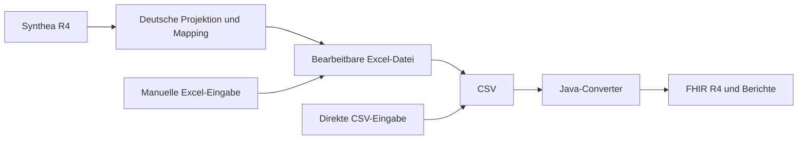

# Architektur und Entwicklung

Die Bedienwege stehen im [Projekteinstieg](../README.md). Diese Seite erklärt die
Aufgabenteilung und die Prüfungen für die Projektentwicklung.

## Ein gemeinsamer Converter

Die Python-Schicht projiziert Synthea auf die menschlich bearbeitbare Vorlage.
Sie schreibt weder fertige klinische FHIR-Zielressourcen noch einen zweiten
FHIR-Converter. Die FHIR-Erzeugung und Profilvalidierung bleiben im bestehenden
Java-Converter. Excel und CSV sind ausdrücklich unterstützte Eingabewege;
die Zwischenstufen ermöglichen einen Review und eine manuelle Weiterverarbeitung.

Die Excel→CSV-Stufe verwendet Apache POI und benötigt keine Office-Installation.
Beim Befüllen der vorhandenen Excel-Vorlage verwendet die Synthea-Schicht dagegen
LibreOffice/UNO, um die bestehende Arbeitsmappe und ihre Formatierung zu erhalten.
Eine zweite Java-Konvertierung für Synthea oder eine Parallelimplementierung
aller Mappings würde dieselben fachlichen Regeln an mehreren Stellen verteilen.

## Einstiegspunkte und Zuständigkeiten

| Bestandteil | Aufgabe / Aufrufer |
| --- | --- |
| `compose.synthea.yml` | Baut und startet den vollständigen Workflow; Nutzer ändern hier native Synthea-Argumente. |
| `scripts/run_synthea_workflow.py` | Prüft den Generatorstand und die Optionen, erzeugt einen Laufordner, startet Synthea und den Import. |
| `scripts/run_synthea_cases.py` | Verarbeitet vorhandene Quellbundles einzeln; erstellt Excel, ruft Java auf, prüft Berichte und vergleicht die Ergebnisse. |
| `scripts/synthea_to_excel.py` | Bereitet die Zeilen vor und füllt eine Kopie der Vorlage. Lädt die klinischen Mappingmodule. |
| `scripts/WorkbookUno.java` | Technischer LibreOffice-Zugriff; wird durch den Python-Helfer gestartet. |
| `scripts/WorkflowOptions.java` | Verwendet den vorhandenen Java-Optionsparser und die ID-Regeln für die Workflow-Vorprüfung. Keine separate Properties-/ID-Implementierung in Python. |
| `Excel2FhirMain` / `life.csv2fhir.Main` | Bestehende Excel- und CSV-Einstiegspunkte im selben Converter-JAR. |
| `scripts/check_synthea_roundtrip.py` | Automatischer Abgleich mit der Quelle einschließlich Mappingentscheidungen, Patienten-ID-Optionen und Kopien. |
| `scripts/audit_synthea_projection.py` | Zusätzlicher unabhängiger Prüfer für Default-Läufe; ruft die Import-/Mappingfunktionen nicht auf. Eigene ID-Optionen und Patientenkopien werden von diesem zusätzlichen Prüfer noch nicht unterstützt. |

Build-/Migrationshelfer unter `scripts/` werden nicht automatisch im normalen
Workflow ausgeführt. Python kompiliert importierte Module bei Bedarf nach
`__pycache__/*.pyc`; dieser Cache ist entbehrlich und nicht versioniert.

## Konfiguration und Datenbestand

- `scripts/synthea-version.txt` pinnt den Quellcommit. Ein Versionswechsel erfordert
  einen erneuten Inventar-/Mappingabgleich.
- `scripts/mappings/*.json` enthalten die versionierten deutschen Zuordnungen,
  Begründungen und Quellen. `sourceFiles` nennt die Fundstellen im Synthea-Quellcode;
  die genannten Dateien müssen zur Laufzeit nicht lokal vorhanden sein.
- `german-demographics.json` und `german-name-supplement.json` enthalten synthetische
  Namens-/Adressbausteine. Sie werden mit ausgeliefert.
- `synthea-source-code-registry.json` beschreibt Quellkonzepte und ihre Verwendung.
  Es dupliziert keine Mappingentscheidungen. Abdeckung des festgelegten Inventars
  bedeutet eine ausdrückliche Entscheidung, nicht zwingend einen deutschen Code
  oder vollständigen Import aller Synthea-Ressourcentypen.
- `outputSynthea/converter-options.config` ist die mitgelieferte, bearbeitbare
  Workflow-Konfiguration. Ohne Datei werden dieselben Defaults erzeugt. Jeder
  Lauf bewahrt einen Snapshot und die wirksamen Werte auf.
- Die wirksamen Optionen stehen anschließend im Excel-Blatt. Änderungen dort
  gelten bei erneuter direkter Konvertierung dieser Datei. Java bleibt für die
  Bedeutung und Prüfung der Optionen maßgeblich.

## Ergebnisse und Prüfgrenzen

Die Originalquellen bleiben erhalten. `Fall.loss.json` dokumentiert Projektionen
und Auslassungen, `*.import.json` den tatsächlichen Import, `*.validation.json`
die FHIR-Prüfung. Der komplette Workflow kopiert nur vollständig importierte und
gegen die Quelle abgeglichene Ergebnisse in seinen zentralen Ordner `fhir/`.
Teilresultate bleiben für die Fehlersuche unter `cases/` sichtbar.

`environment.json` und `workflow.json` halten Versionen, Eingaben und Prüfsummen
fest. Seeds und Simulationsdatum erlauben reproduzierbare Synthea-Läufe; derselbe
Seed ist keine Anforderung an neue, garantiert andere Patienten-IDs. Wer getrennte
Bestände benötigt, verwendet passende Seeds bzw. bewusst unterschiedliche
Patienten-ID-Präfixe. Es gibt keine zentrale serverübergreifende ID-Vergabestelle.

Der automatische Rückvergleich und der unabhängige Audit prüfen technische
Datenübernahme. Medizinische Gleichwertigkeit synthetischer Ergänzungen und
vollständige Terminologiezugehörigkeit brauchen zusätzliche Prüfung. Die
mitgelieferten Profile ersetzen keinen vollständigen Terminologieserver.

## Container und CI

`docker/Dockerfile` enthält den bisherigen Java-Converter.
`docker/synthea.Dockerfile` nutzt gemeinsame Stufen für den Importer und den
vollständigen Workflow. Nur das Target `workflow` enthält zusätzlich Synthea.
Compose bündelt die Werkzeuge; eine zusätzliche lokale Python-/Office-Toolchain
ist für diesen Weg nicht erforderlich.

Die CI-Konfiguration prüft Java/Python, CodeQL, beide Synthea-Wege und Images mit
Trivy. Die bekannten Sicherheitsbefunde des Generators sind in
[Ticket #55](https://github.com/medizininformatik-initiative/excel2fhir/issues/55)
separat erfasst. Die vollständige Imageprüfung darf dadurch nicht stillschweigend
entfallen. Der Releasejob hängt aktuell auch vom Workflow-Check ab.
