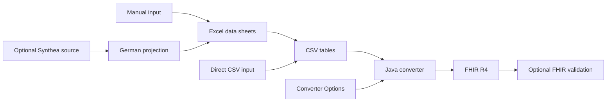

# Architecture and development

## Shared conversion pipeline

The Java converter produces FHIR R4 from CSV tables. Excel2FHIR uses Apache POI
to extract workbook data into CSV and invokes that converter. The workbook's data
sheets define cases; Converter Options define KDS variants. Invocation options
control output formats, bundle size and FHIR validation.

| Component | Responsibility |
| --- | --- |
| `Excel2FhirMain` | Reads workbooks and options sets, exports CSV and invokes conversion. |
| `life.csv2fhir.Main` | Converts CSV inputs using the selected options sets. |
| `ConverterOptionSet` / `ConverterOptions` | Select, parse and check options; supply shared defaults. |
| `Converter` | Creates resources and references from case data. |
| `WorkflowRun` | Manages run directories, output and reports. |

[Converter usage](converter-usage.md) defines the common input and output contract.

## Synthea input

The Python importer projects Synthea R4 bundles into copies of the Excel template.
LibreOffice/UNO fills existing cells while preserving workbook formatting.
Generated options sheets contain the shared converter defaults. Selected external
options files and conversion parameters are passed to Excel2FHIR.

| Component | Responsibility |
| --- | --- |
| `run_synthea_container.py` | Runs under the output directory owner's UID/GID. |
| `run_synthea_workflow.py` | Checks the pinned generator and options, then runs generation and import. |
| `run_synthea_cases.py` | Creates workbooks, invokes Excel2FHIR and compares each KDS variant with its source. |
| `synthea_to_excel.py` | Prepares rows using clinical mappings and fills the template. |
| `WorkbookUno.java` | Provides LibreOffice access. |
| `WorkflowOptions.java` | Uses the Java option parser and patient-ID rules for preflight checks. |
| `fhir_output.py` / `ReadXmlBundles.java` | Read emitted formats for source comparison. |
| `check_synthea_roundtrip.py` | Checks supported data, reference directions, patient IDs and copies. |
| `procedure_projection.py` / `audit_procedures.py` | Project procedures and audit source-to-Excel-to-FHIR associations. |
| `audit_synthea_projection.py` | Independently audits output with standard IDs and one patient per source. |

These files live under `scripts/`. The generator revision is pinned in
`scripts/synthea-version.txt`. Mapping tables under `scripts/mappings/` record
versions, source references and assumptions. The source-code registry inventories
source concepts; the mapping tables hold the projection decisions.

## Traceability

Synthea runs retain original bundles, editable workbooks and per-source converter
runs. `Fall.loss.json` records projections and omissions; `summary.json` records
conversion and source-comparison results. `environment.json` and `workflow.json`
record versions, inputs and checksums. See [Synthea output](synthea-workflow.md#output).

Seeds and simulation dates support reproducible generation. Patient-ID options
allow separate output populations. Source comparison verifies the documented
projection; clinical review assesses the synthetic assumptions and terminology.

## Build and CI

Use `mvn test` for Java changes and documentation checks, and `mvn test package`
for packaging changes. Python checks run with
`python3 -m unittest discover -s scripts/tests -v`.

`docker/Dockerfile` builds the Excel/CSV converter. `docker/synthea.Dockerfile`
adds Python and LibreOffice for import; its `workflow` target also includes the
pinned Synthea generator. CI runs Java/Python tests, CodeQL, Synthea integration
checks and Trivy image scans. Release builds depend on the workflow checks.
