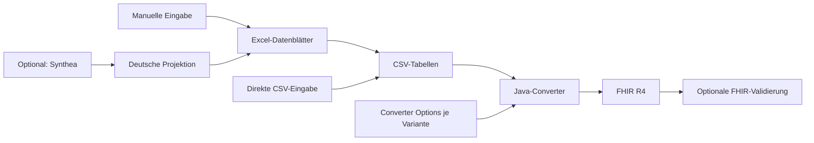

# Architektur und Entwicklung

Die Bedienwege stehen im [Projekteinstieg](../README.md). Diese Seite erklärt die
Aufgabenteilung und die Prüfungen für die Projektentwicklung.

## CSV-Converter und Excel-Eingabe

Der Java-Converter erzeugt FHIR R4 aus CSV-Tabellen. Excel2FHIR stellt darüber
bearbeitbare Arbeitsmappen bereit: Die Datenblätter beschreiben Patienten und
Fälle, Apache POI überführt sie in CSV, anschließend erzeugt der Converter die
FHIR-Ressourcen. Das Befüllen der Excel-Vorlage ist der normale Einstieg.

Converter Options bestimmen den KDS-Dialekt, etwa Referenzrichtungen und
Patienten-IDs. Die Aufrufparameter bestimmen Ausgabeformate, Bundle-Aufteilung
und FHIR-Validierung. Diese Aufgabenteilung gilt für alle Eingabewege.

## Optionsvarianten und Ergebnisse

`ConverterOptionSet` liest die Optionssätze für Excel und CSV. Jedes Excel-Blatt,
dessen Name `Konvertierungsoptionen` enthält, beschreibt eine eigenständige
Variante desselben Falls. Wiederholtes `--converter-options DATEI` wählt die
externen Optionssätze für den Aufruf. Fehlende Werte ergänzt `ConverterOptions`
aus den gemeinsamen Defaults. Namen und Werte werden vor der Konvertierung geprüft.

Jeder Aufruf erzeugt einen eigenen Laufordner. Unter `fhir/` erhält jede Variante
einen Ordner; mehrere Eingaben werden zusätzlich getrennt. `details/options/`
enthält die wirksamen Optionen, `details/reports/` die Importberichte und die
mit `-v` angeforderten Validierungsberichte. Der Converter schreibt die mit `-r`
ausgewählten Formate und teilt Patienten mit `-p` auf Bundles auf.

| Bestandteil | Aufgabe |
| --- | --- |
| `Excel2FhirMain` | Liest Arbeitsmappen und Optionsvarianten, exportiert CSV und startet den Converter. |
| `life.csv2fhir.Main` | Konvertiert vorhandene CSV-Datensätze mit den gewählten Optionsvarianten. |
| `ConverterOptionSet` / `ConverterOptions` | Wählt Optionssätze, prüft Werte und ergänzt Defaults. |
| `Converter` | Erzeugt FHIR-Ressourcen und deren Referenzen aus den Falldaten. |
| `WorkflowRun` | Verwaltet Laufordner, Ausgaben und Berichte. |

## Synthea als Quelle für Excel

Die optionale Python-Schicht projiziert Synthea-R4-Bundles auf die Excel-Vorlage.
Sie füllt mit LibreOffice/UNO eine Kopie der vorhandenen Arbeitsmappe und erhält
deren Formatierung. Die erzeugten Optionsblätter enthalten die gemeinsamen
Converter-Defaults. Für den jeweiligen Aufruf gewählte externe Optionsdateien
werden an Excel2FHIR weitergegeben; ebenso Formatwahl, Bundle-Aufteilung und
Validierung. So kann dieselbe Arbeitsmappe anschließend direkt weiterbearbeitet
und mit den gewünschten Varianten konvertiert werden.

| Bestandteil | Aufgabe |
| --- | --- |
| `compose.synthea.yml` | Startet die Erzeugung und anschließende Konvertierung; gemeinsame Parameter stehen vor `--`, Synthea-Parameter dahinter. |
| `scripts/run_synthea_container.py` | Führt den Workflow unter UID/GID des Ausgabeordners aus. |
| `scripts/run_synthea_workflow.py` | Prüft Generatorstand und Optionen, startet Synthea und den Import. |
| `scripts/run_synthea_cases.py` | Erstellt Excel-Dateien, ruft Excel2FHIR auf und vergleicht jede Optionsvariante mit der Quelle. |
| `scripts/synthea_to_excel.py` | Bereitet Datenzeilen anhand der klinischen Mappings vor und befüllt die Vorlage. |
| `scripts/WorkbookUno.java` | Technischer LibreOffice-Zugriff. |
| `scripts/WorkflowOptions.java` | Nutzt den Java-Optionsparser für Defaults, Variantennamen und die Vorprüfung der Patienten-IDs. |
| `scripts/fhir_output.py` / `scripts/ReadXmlBundles.java` | Lesen die gewählten Ausgabeformate für den Rückvergleich. |
| `scripts/check_synthea_roundtrip.py` | Prüft Datenübernahme, Referenzrichtungen, Patienten-ID-Optionen und Kopien. |
| `scripts/procedure_projection.py` / `scripts/audit_procedures.py` | Projizieren Prozeduren und prüfen sie anhand der Quellen, Excel-Zeilen und FHIR-Ressourcen. |
| `scripts/audit_synthea_projection.py` | Zusätzlicher unabhängiger Prüfer für Läufe mit Standard-IDs und je einem Patienten. |

### Mappingdaten und Nachvollziehbarkeit

`scripts/synthea-version.txt` pinnt den Generatorcommit. Ein Versionswechsel
erfordert einen Inventar- und Mappingabgleich. `scripts/mappings/*.json` enthalten
die versionierten deutschen Zuordnungen, Begründungen und Quellen.
`sourceFiles` nennt die Fundstellen im Synthea-Quellcode.
`german-demographics.json` und `german-name-supplement.json` liefern synthetische
Namens- und Adressbausteine. `synthea-source-code-registry.json` beschreibt die
Quellkonzepte und ihre Verwendung.

Die Originalquellen bleiben im Laufordner erhalten. `Fall.loss.json` dokumentiert
Projektionen und Auslassungen, `*.import.json` den tatsächlichen Import.
Die gewählten FHIR-Ausgaben stehen unter `fhir/` zur Prüfung bereit;
`summary.json` enthält den Status der Konvertierung und des Rückvergleichs.
Details je Quelldatei einschließlich der wirksamen Optionssätze liegen unter
`details/cases/`. `environment.json` und `workflow.json` halten Versionen,
Eingaben und Prüfsummen fest.

Seeds und Simulationsdatum erlauben reproduzierbare Synthea-Läufe. Getrennte
Datenbestände erhalten passende Seeds und Patienten-ID-Präfixe. Der automatische
Rückvergleich und der unabhängige Audit prüfen die technische Datenübernahme.
Die medizinische Plausibilität synthetischer Ergänzungen und vollständige
Terminologiezugehörigkeit brauchen zusätzliche Prüfung.

## Build, Container und CI

Maven baut und prüft den Java-Converter. Python-Tests laufen mit
`python3 -m unittest discover -s scripts/tests -v`.
`docker/Dockerfile` enthält den Excel-/CSV-Converter.
`docker/synthea.Dockerfile` ergänzt Python und LibreOffice für den Import;
das Target `workflow` enthält außerdem den gepinnten Synthea-Generator.

Die CI prüft Java/Python, CodeQL, beide Synthea-Wege und Images mit Trivy.
Die Sicherheitsbefunde des Generators sind in
[Ticket #55](https://github.com/medizininformatik-initiative/excel2fhir/issues/55)
erfasst. Der Releasejob hängt auch vom Workflow-Check ab.
