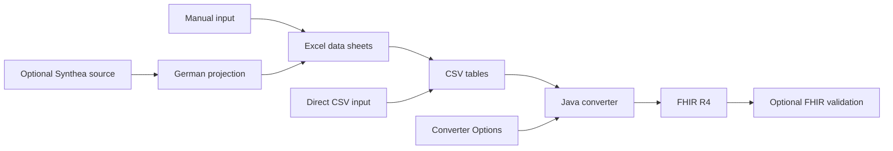

# Architecture and development

## Shared conversion pipeline

The Java converter produces FHIR R4 from CSV tables. Excel2FHIR uses Apache POI
to extract workbook data into CSV and invokes that converter. The workbook's data
sheets define cases; Converter Options define KDS variants. Invocation options
control output formats, bundle size and FHIR validation.

```mermaid
flowchart LR
  M[Manual input] --> E[Excel data sheets]
  E --> C[CSV tables]
  D[Direct CSV input] --> C
  C --> J[Java converter]
  O[Converter Options] --> J
  J --> F[FHIR R4]
  F --> V[Optional FHIR validation]
  S[Optional Synthea source] --> P[German projection]
  P --> E
```

| Component | Responsibility |
| --- | --- |
| `Excel2FhirMain` | Reads workbooks and options sets, exports CSV and invokes conversion. |
| `life.csv2fhir.Main` | Converts CSV inputs using the selected options sets. |
| `ConverterOptionSet` / `ConverterOptions` | Select, parse and check options; supply shared defaults. |
| `Converter` | Creates resources and references from case data. |
| `WorkflowRun` | Manages run directories, output and reports. |

[Converter usage](converter-usage.md) defines the common input and output contract.

## Contact reconstruction and matching

Each `ConverterResult` owns its `ContactConversionState` and `ContactIndex`.
Contact reconstruction can interleave independent conversions without sharing the
current facility, department, primary stay or derived-end bookkeeping. IDs are
allocated from the resources of that conversion result.

The input index records patient identity, facility case, contact level, original
parent, source row and whether a care-location contact is secondary. It retains
live input encounters so end times completed by later rows are available to
matching. Output copies can omit patient references or change `partOf` without
changing this input hierarchy. An Encounter without `partOf` is not sufficient
evidence for a facility contact; explicit contact-level coding is preserved when
FHIR resources are copied or serialized.

The matching API requires the same patient and requested level, includes both
period boundaries, and treats a missing end as open. It chooses the latest start
and then the earliest input row. Timestamp candidates are tried in order until a
match is found. Operation, consultation and examination/treatment contacts are
excluded from automatic care-location targets. Input case lookup uses patient ID
and case number together.

`ContactOutputPolicy` selects emitted contact levels and derives `partOf` from
that index. When all levels are deselected, the facility case is emitted as a
general Encounter without its KDS contact-level coding or profile claim.
`ClinicalEncounterAssignment` uses per-resource input context captured by the
converter, retaining patient identity after patient references are removed.
It applies the configured clinical timestamp candidates and contact level.
DocumentReference strategies distinguish supplied contacts, missing contacts,
unresolved contacts and an explicitly entered output timestamp. The generated
run timestamp is not used for matching. Reference omissions and conflicts appear
in `encounterReferenceIssues` in the import report.

These projections are shared by JSON and NDJSON output. Versioned contract defaults execute through the same Excel, CSV and web pipeline.

## Resource output and medication transformations

`MedicationTransformations` replaces requests first and then applies the selected
administration/statement actions to one snapshot. Derived IDs use the source
resource identity, destination type and transformation stage. Input context is
copied to the derived resource; original resources remain unchanged.

`ResourceOutputPolicy` controls boolean resource selections and Medication/Location
output modes after derivations. Reference-only descriptions use internal resources
without emitting them. References to known deselected or replaced internal targets
are removed. Absolute external references are preserved. Output accounting counts
resources after projection, consistently for JSON and NDJSON.

The import report includes resource omissions and medication transformations with
unmapped fields and missing target facts. `DarOverrides` then applies the bundled
field catalogue to output copies. It preserves coding discriminators, replaces
measurement values with `dataAbsentReason`, and clears attachment size/hash with
the bytes. Missing scalar choices use the converter’s dateTime representation;
repeated parents are never synthesized. DAR replacements are applied independently
of narrative availability and Condition status/end validity.

`EncounterOutputPolicy` transforms output ends after internal matching. `ContactIndex`
retains whether each original row supplied an end value independently of later
derivations. End policies update status before DAR. Class-scoped DAR overrides
common Encounter DAR; location periods mirror the final period while DAR preserves
the pre-DAR Encounter and location statuses. See [encounter end semantics](../web/catalog/options/README.md#encounter-classes-and-output-end-rules).

`AdditionalIdentifiers` has one instance per option set. It allocates counts over
original resources and potential medication derivatives before output selection,
then appends identifiers after DAR. A resource identity and repetition consume
one count per rule across formats and patient bundles. Collision checks include
existing identifiers whenever a generated pair is involved. The workbench validates Properties with `ConfigurationPreflight` and stores them
unchanged in the immutable job snapshot.

## Synthea input

The Python importer projects Synthea R4 bundles into copies of the Excel template.
LibreOffice/UNO fills existing cells while preserving workbook formatting.
Generated workbooks contain case data. One external configuration and conversion
parameters are passed to Excel2FHIR; without a file, shared defaults apply.

| Component | Responsibility |
| --- | --- |
| `run_synthea_container.py` | Runs under the output directory owner's UID/GID. |
| `run_synthea_workflow.py` | Checks the pinned generator and options, then runs generation and import. |
| `run_synthea_cases.py` | Creates workbooks, invokes Excel2FHIR and compares each KDS variant with its source. |
| `synthea_to_excel.py` | Prepares rows using clinical mappings and fills the template. |
| `WorkbookUno.java` | Provides LibreOffice access. |
| `WorkflowOptions.java` | Uses the Java option parser and patient-ID rules for preflight checks. |
| `fhir_output.py` / `ReadXmlBundles.java` | Read emitted formats for source comparison. |
| `check_synthea_roundtrip.py` | Checks supported data, reference directions, patient IDs and copies. |
| `procedure_projection.py` / `audit_procedures.py` | Project procedures and audit source-to-Excel-to-FHIR associations. |
| `audit_synthea_projection.py` | Independently audits output with standard IDs and one patient per source. |

These files live under `scripts/`. The generator revision is pinned in
`scripts/synthea-version.txt`. Mapping tables under `scripts/mappings/` record
versions, source references and assumptions. The source-code registry inventories
source concepts; the mapping tables hold the projection decisions.

## Traceability

Synthea runs retain original bundles, editable workbooks and per-source converter
runs. `Fall.loss.json` records projections and omissions; `summary.json` records
conversion and source-comparison results. `environment.json` and `workflow.json`
record versions, inputs and checksums. See [Synthea output](synthea-workflow.md#output).

Seeds and simulation dates support reproducible generation. Patient-ID options
allow separate output populations. Source comparison verifies the documented
projection; clinical review assesses the synthetic assumptions and terminology.

## Build and CI

Use `mvn test` for Java changes and documentation checks, and `mvn test package`
for packaging changes. Python checks run with
`python3 -m unittest discover -s scripts/tests -v`.

`docker/Dockerfile` builds the Excel/CSV converter. `docker/synthea.Dockerfile`
adds Python and LibreOffice for import; its `workflow` target also includes the
pinned Synthea generator. CI runs Java/Python tests, CodeQL, Synthea integration
checks and Trivy image scans. Release builds depend on the workflow checks.

## Clinical time shifts

`ClinicalTimeShift` shifts the internally derived resource graph once before
medication transformations, reference assignment and encounter output end rules.
It stages all replacements before mutation, preserves primitive precision and
explicit offsets, and excludes resource metadata. `ContactIndex` retains the
same encounter objects, so clinical events and their candidate periods move
together. Incomplete dates reject a nonzero shift explicitly.
